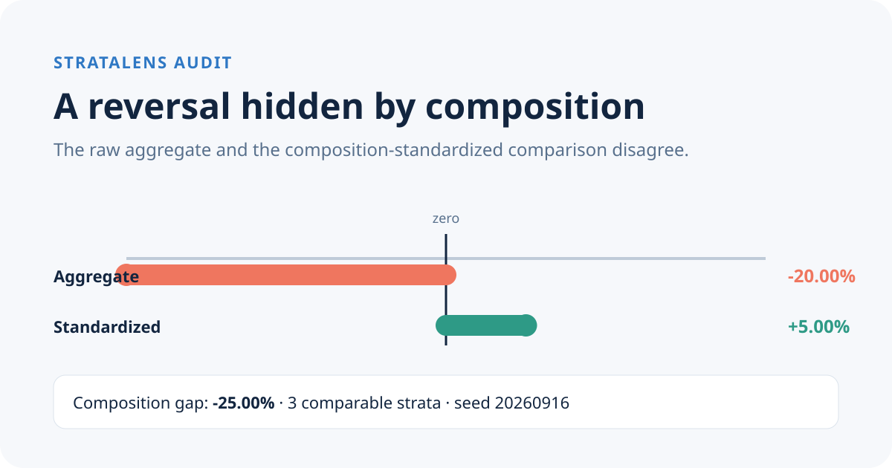

# StrataLens

> See when a clean aggregate claim changes direction after both groups are compared on the same stratum mix.



StrataLens is a dependency-free Python audit for binary comparisons. It calculates the raw treated-minus-control outcome difference, standardizes both groups to the pooled distribution of comparable strata, measures the composition gap, and makes any sign reversal explicit.

It is built for the moment before someone writes "the treatment performed worse" from one aggregate number. StrataLens does not decide which strata are valid or turn observational data into a causal study. It makes the supplied comparison easier to inspect.

## Demo result

The included synthetic checkout fixture has 2,000 rows across low, medium, and high intent. Treatment improves conversion by exactly 5 percentage points inside every stratum, but treated rows are concentrated in low intent while control rows are concentrated in high intent.

| View | Control | Treated | Treated minus control |
|---|---:|---:|---:|
| Raw aggregate | 46.00% | 26.00% | **-20.00%** |
| Pooled-stratum standardized | 33.50% | 38.50% | **+5.00%** |

StrataLens labels this a `strong_reversal`. The 1,000-replicate deterministic row-bootstrap interval was `[-24.00%, -15.92%]` for the aggregate effect and `[+0.22%, +9.21%]` for the standardized effect. This is generated evidence from a synthetic fixture, not an empirical product claim.

## Run it

Requires Python 3.10 or newer and no runtime dependencies.

```bash
python scripts/generate_demo.py
python -m stratalens analyze examples/checkout_demo.csv \
  --out artifacts/demo \
  --seed 20260916 \
  --bootstrap 1000 \
  --title "Synthetic checkout audit"
```

The output directory contains:

- `analysis.json`: schema-versioned calculation evidence.
- `report.html`: a standalone responsive report with no external assets.
- `overview.svg`: a compact visual generated from the same result.

Install the console command if preferred:

```bash
python -m pip install -e .
stratalens analyze examples/checkout_demo.csv --out artifacts/demo
```

## Input contract

```csv
stratum,treatment,outcome,weight
low_intent,1,0,1.0
high_intent,0,1,1.0
```

- `stratum` must be non-empty.
- `treatment` and `outcome` must be exactly `0` or `1`.
- `weight` is optional. When present, it must be finite and positive.
- Column names can be changed through the matching CLI options.
- At least one stratum must contain both groups.

## What the calculation means

For each comparable stratum \(s\), StrataLens calculates treated and control outcome rates. It then gives that stratum the pooled share

```text
pooled weight in stratum s / pooled weight across comparable strata
```

and applies the same shares to both groups. The standardized effect therefore answers a focused descriptive question: what difference would these observed stratum-specific rates produce under one common mix?

The composition gap is:

```text
aggregate effect - standardized effect
```

A `strong_reversal` requires opposite nonzero signs for the aggregate and standardized effects, plus agreement between every nonzero comparable stratum effect and the standardized direction. Mixed strata receive a separate `mixed_reversal` label.

## Verification

```bash
python -m compileall -q stratalens tests scripts
python -m unittest discover -s tests -v
python -m pip install -e .
python -m build
python -m pip check
```

The test suite covers strict CSV validation, weights, effective sample size, standardization, strong and mixed reversals, incomplete overlap, deterministic bootstrap output, and safe report-data embedding. Local verification used Python 3.14.7. The current GitHub OAuth credential could not publish a workflow file without the additional `workflow` scope, so no hosted version matrix is claimed.

## Interpretation limits

- Standardization only addresses the supplied measured strata.
- The tool does not identify confounders or establish causality.
- Sparse strata can produce unstable rates and intervals.
- The row bootstrap assumes rows are the sampling units. Clustered or repeated observations need a design-aware analysis.
- Positive weights are accepted as analysis weights, but StrataLens does not infer a survey design.
- Percentile intervals are descriptive uncertainty summaries.
- Version 0.1 supports binary treatments and outcomes only.

## Project evidence

- [Approved design](docs/superpowers/specs/2026-09-16-stratalens-spec.md)
- [Calculation decision](docs/decisions/0001-pooled-standardization.md)
- [Synthetic dataset card](docs/datasets/checkout-demo.md)
- [Model non-use card](docs/models/model-card.md)
- [Verification record](docs/experiments/2026-09-16-verification.md)
- [Implementation notes](docs/notes/2026-09-16.md)
- [Visual provenance](docs/assets/README.md)

## License

MIT. The synthetic fixture and generated visual are released with this repository.
